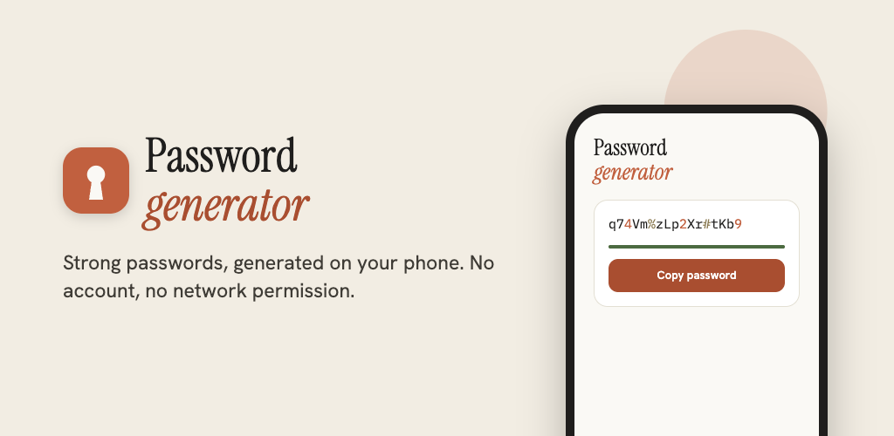
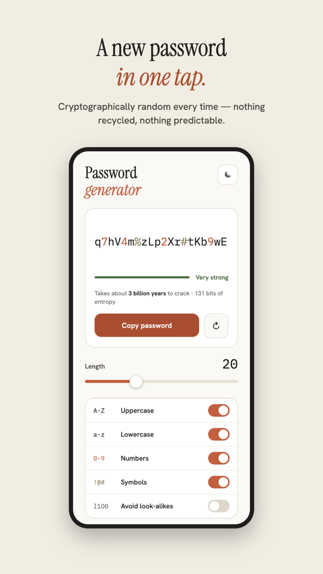
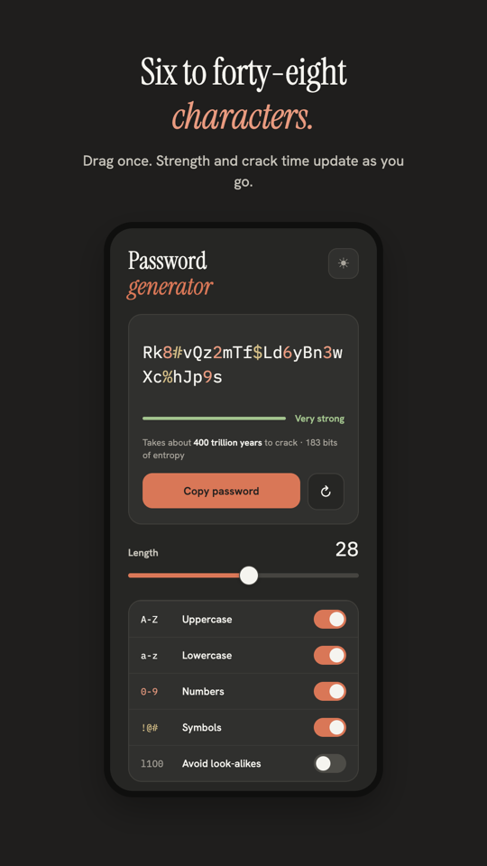
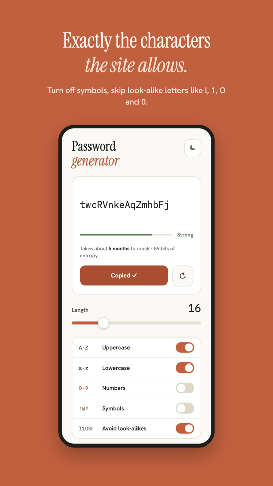
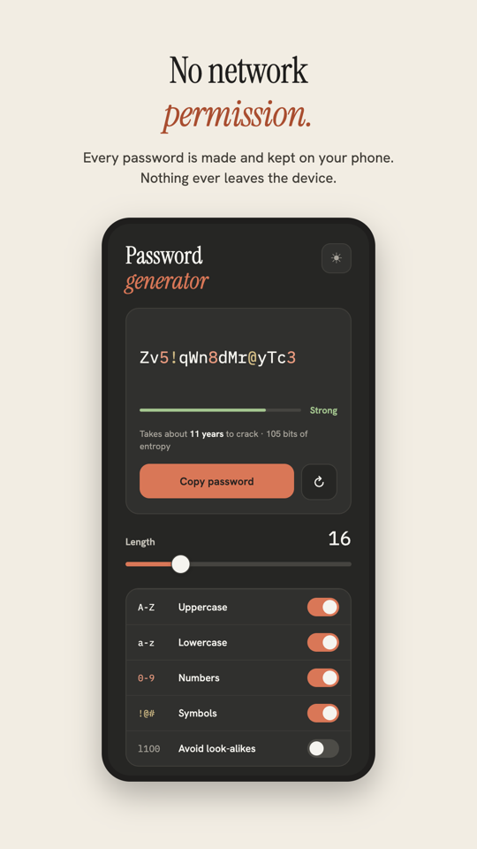

# Password Generator

<p align="center">
  
</p>

一个完全离线的 Android 随机密码生成器。用 Kotlin + Jetpack Compose 编写，不申请任何权限（包括 `INTERNET`），密码在本机生成、在本机停留。

> **🤖 本项目 100% 由 AI 编写。** 应用代码、单元测试、视觉设计、商店素材与这份 README，全部由 Claude 生成，人类只负责提出需求和验收。详见 [关于「全部由 AI 编写」](#关于全部由-ai-编写)。

---

## 产品介绍

密码管理器很好用，但有时你只想要**一串足够强的随机字符**——注册新账号、重置路由器口令、给同事发一个临时密码。这个应用只做这一件事，并且做到没有任何可疑之处：

- **一打开就有一个可用的密码。** 冷启动即生成，点一下刷新按钮换一个，不需要注册、登录或联网。
- **强度是算出来的，不是猜的。** 每次生成都会实时显示香农熵（bits）和按每秒 1000 亿次爆破估算的破解耗时，从 "Weak" 到 "Very strong" 四档。
- **字符集完全由你决定。** 大写、小写、数字、符号可以逐项开关，长度 6–48 无级可调，改动即时反映在强度上。
- **可以排除易混字符。** 打开 "Avoid look-alikes"，`l 1 I O 0 o B 8 S 5 Z 2` 会被剔除——适合需要人工抄写或电话口述的密码。
- **随机源是 `SecureRandom`。** 不是 `Math.random()`，不是时间戳种子；每次都是密码学安全的随机结果，不复用、不可预测。
- **没有网络权限。** `AndroidManifest.xml` 里一条权限都没有声明，这一点应用内也直接写明——它在技术上就不可能把你的密码传出去。
- **亮色 / 暗色主题**，一键切换。

---

## 界面一览

| 一键生成 | 长度可调 |
| :---: | :---: |
|  |  |
| **随时生成一个新的**：每次都是密码学安全的随机结果，不复用、不可预测。 | **6 到 48 个字符**：拖一下滑块，强度和破解耗时随之更新。 |

| 字符集可选 | 完全离线 |
| :---: | :---: |
|  |  |
| **只用站点允许的字符**：关掉符号，跳过 `l`、`1`、`O`、`0` 这类易混字母。 | **没有网络权限**：每个密码都在本机生成并留在本机，绝不离开设备。 |

> 上述视觉稿来自 [Claude Design 设计文件](https://claude.ai/design/p/c7e5da90-9ca3-4e0e-9a4a-eefa9653114c?file=Play+Store+Assets.dc.html)，同时用作 Google Play 的商店素材（特色图 1024 × 500，截图 1080 × 1920）。

---

## 强度是怎么算的

熵按均匀随机字符串计算：

```
entropy = length × log2(poolSize)
```

`poolSize` 是当前开启的字符集去掉易混字符后的实际大小。破解耗时按穷举一半密钥空间、每秒 10¹¹ 次尝试估算：

```
seconds = 2^(entropy − 1) / 1e11
```

分档阈值（`Strength.of`）：`< 45` Weak，`< 65` Fair，`< 90` Strong，`≥ 90` Very strong。

例如默认的 20 位、四类字符全开：字符池 86 个字符，约 129 bits，属于 Very strong。

---

## 技术栈

| | |
| --- | --- |
| 语言 | Kotlin（JVM toolchain 17） |
| UI | Jetpack Compose + Material 3，Compose BOM |
| 架构 | `ViewModel` + `StateFlow` 单向数据流 |
| 导航 | Navigation 3 |
| 随机源 | `java.security.SecureRandom` |
| 最低版本 | minSdk 24（Android 7.0），targetSdk / compileSdk 36 |
| 权限 | 无 |

主要代码：

```
app/src/main/java/dev/passgen/app/
├── data/PasswordGenerator.kt      # 字符集、生成、熵与破解耗时估算
├── ui/main/MainScreen.kt          # Compose 界面
├── ui/main/MainScreenViewModel.kt # 状态与生成动画
└── theme/                         # 配色与字体
```

---

## 构建与运行

```bash
# Debug 安装到已连接的设备
./gradlew installDebug

# 单元测试
./gradlew test

# 仪器化测试（需要设备或模拟器）
./gradlew connectedAndroidTest

# Release 包
./gradlew assembleRelease
```

Release 签名信息从仓库根目录的 `keystore.properties` 读取（该文件不入版本库）：

```properties
storeFile=passgen-release.jks
storePassword=…
keyAlias=…
keyPassword=…
```

文件不存在时 release 构建会输出未签名包，因此全新 clone 和 CI 都能直接跑通。

---

## 关于「全部由 AI 编写」

这个仓库里没有一行手写代码。从空目录到可上架的签名包，每一步都由 [Claude](https://claude.com/claude-code) 完成：

| 产出 | 说明 |
| --- | --- |
| 应用代码 | `PasswordGenerator.kt` 的生成与熵计算、Compose 界面、`ViewModel` 状态流、主题配色，全部由 AI 编写 |
| 测试 | `PasswordGeneratorTest`、`MainScreenViewModelTest` 单元测试与 `MainScreenTest` 仪器化测试同样由 AI 编写 |
| 视觉设计 | 界面稿、应用图标、Google Play 特色图与四张商店截图，在 [Claude Design](https://claude.ai/design/p/c7e5da90-9ca3-4e0e-9a4a-eefa9653114c?file=Play+Store+Assets.dc.html) 中生成 |
| 工程配置 | Gradle 脚本、版本目录、签名配置、`.gitignore` |
| 文档 | 这份 README，以及每一条 commit message |

人类在整个过程中只做两件事：**提需求**和**验收**——决定要做什么、看结果对不对、指出哪里要改。具体怎么实现、用什么架构、界面长什么样，都是 AI 的判断。

这也意味着一句必要的提醒：**代码没有经过人工逐行审查。** 密码生成用的是 `java.security.SecureRandom`，熵与破解耗时的公式写在上一节里、可以自行核对，但如果你要把它用在高风险场景，请先自己读一遍 `app/src/main/java/dev/passgen/app/data/PasswordGenerator.kt`——它只有一百多行。

---

## 隐私

没有账号，没有分析统计，没有崩溃上报，没有网络权限。生成的密码只存在于设备内存和你主动复制到的剪贴板中。
